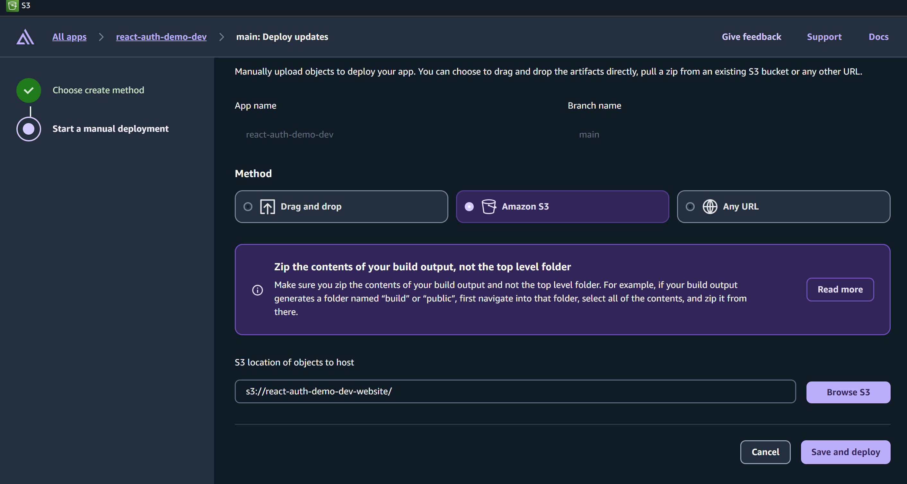
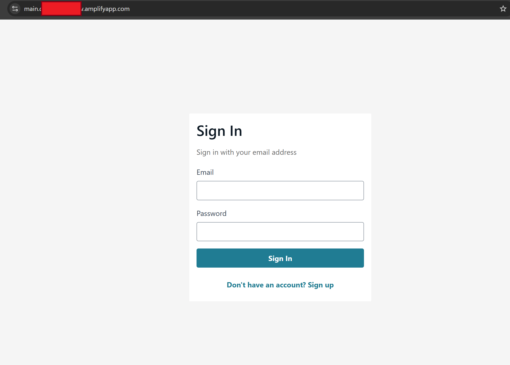
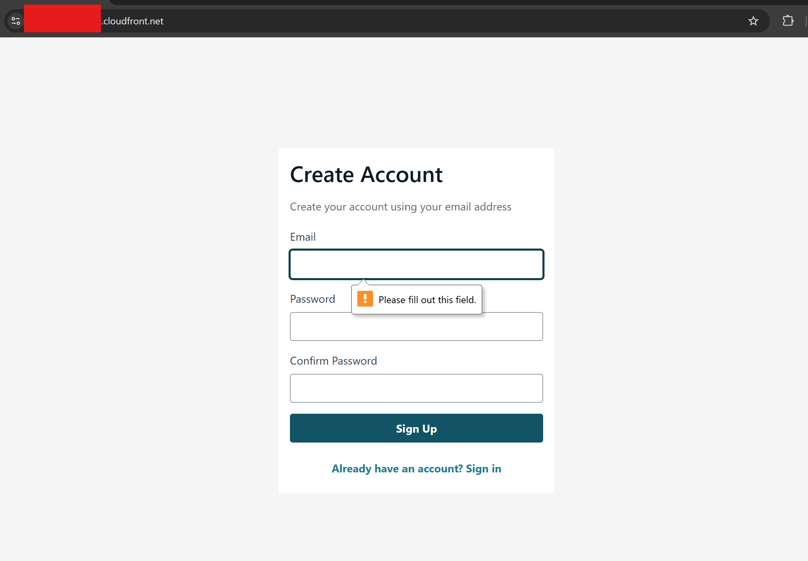
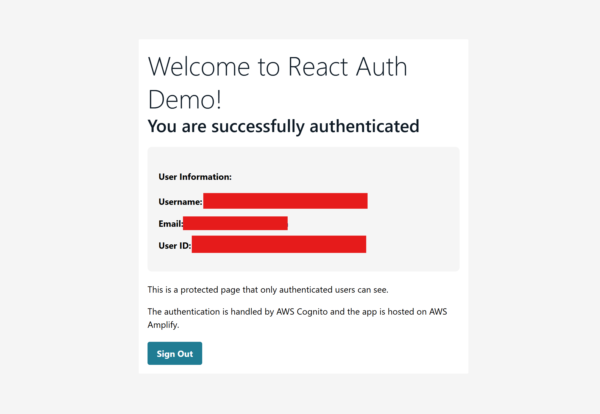

# React.js Hosting Strategy Comparison: Amplify vs S3+CloudFront vs Elastic Beanstalk

This project provides a **comprehensive comparison** of three different hosting strategies for React.js applications with AWS Cognito authentication, all deployed using OpenTofu (formerly Terraform). Compare the pros, cons, costs, and setup complexity of each approach to choose the best hosting solution for your needs.

## 🏗️ Project Overview

This comparison project demonstrates the **same React.js application** deployed using three different AWS hosting strategies:

- **Frontend**: React.js with AWS Amplify UI components
- **Authentication**: AWS Cognito User Pool (shared across all hosting options)
- **Infrastructure**: OpenTofu (Terraform) for infrastructure as code
- **Build Automation**: Local npm build + automated deployment via Terraform

### 🎯 Comparison Focus Areas
- **Setup Complexity**: How easy is it to get started?
- **Deployment Speed**: How fast can you deploy changes?
- **Cost Structure**: What are the ongoing costs?
- **Scalability**: How well does it handle traffic growth?
- **Maintenance**: How much ongoing management is required?
- **Production Readiness**: Which is best for different use cases?

## 📊 Hosting Strategy Comparison

### 🚀 Option 1: AWS Amplify (Git Integration)
**Best for: Rapid development, team collaboration, CI/CD**

**✅ Pros:**
- ⚡ **Fastest setup** - Deploy in minutes
- 🔄 **Automatic deployments** on every Git push
- 🎯 **Built-in CI/CD** with pull request previews
- 🛠️ **Zero configuration** - works out of the box
- 📱 **Mobile app support** included
- 🔍 **Built-in monitoring** and analytics
- 💰 **Pay-per-use** pricing model

**❌ Cons:**
- 💸 **Higher cost** for high-traffic applications
- 🔒 **Vendor lock-in** to AWS Amplify
- ⚙️ **Limited customization** of build process
- 📊 **Less control** over infrastructure details

**⏱️ Setup Time:** ~5 minutes
**💰 Cost:** $0.023/GB served + $0.15/GB stored

---

### 🌐 Option 2: S3 + CloudFront (Static Hosting)
**Best for: Cost-effective static sites, high performance, global distribution**

**✅ Pros:**
- 💰 **Most cost-effective** for static content
- ⚡ **Global CDN** with CloudFront
- 🔒 **HTTPS by default** with AWS certificates
- 📈 **Highly scalable** - handles millions of requests
- 🛠️ **Full control** over infrastructure
- 🔄 **Automated builds** via OpenTofu
- 📊 **Detailed monitoring** with CloudWatch

**❌ Cons:**
- ⏱️ **Slower initial setup** (10-15 minutes)
- 🔧 **Manual configuration** required
- 📝 **More complex** for beginners
- 🚫 **No server-side rendering** support

**⏱️ Setup Time:** ~10-15 minutes
**💰 Cost:** $0.023/GB served + $0.023/GB stored

---

### 🏢 Option 3: Elastic Beanstalk (Production Ready)
**Best for: Production applications, auto-scaling, enterprise features**

**✅ Pros:**
- 🏗️ **Production-ready** with auto-scaling
- ⚖️ **Load balancing** and health monitoring
- 🔄 **Zero-downtime deployments**
- 🛡️ **Enterprise security** features
- 📊 **Comprehensive monitoring** and logging
- 🔧 **Full server control** and customization
- 🚀 **Handles dynamic content** and APIs

**❌ Cons:**
- ⏱️ **Slowest setup** (15-30 minutes)
- 💸 **Higher cost** due to EC2 instances
- 🔧 **Complex configuration** and troubleshooting
- 📚 **Steeper learning curve**
- ⚠️ **Platform compatibility issues** (as we experienced)

**⏱️ Setup Time:** ~15-30 minutes (can be much longer due to platform issues)
**💰 Cost:** $8.50+/month for t3.micro + data transfer

---

### 🎯 Quick Decision Guide

| Use Case | **Winner** | **Runner-up** | **Why Choose Winner** |
|----------|------------|---------------|----------------------|
| **Learning/Prototyping** | 🥇 **Amplify** | S3 + CloudFront | Fastest to get started |
| **Personal Projects** | 🥇 **S3 + CloudFront** | Amplify | Most cost-effective |
| **Team Development** | 🥇 **Amplify** | Elastic Beanstalk | Built-in CI/CD |
| **High-Traffic Static Site** | 🥇 **S3 + CloudFront** | Amplify | Best performance/cost ratio |
| **Production Web App** | 🥇 **Elastic Beanstalk** | Amplify | Full enterprise features |
| **Budget-Conscious** | 🥇 **S3 + CloudFront** | Amplify | Lowest ongoing costs |
| **Enterprise/Compliance** | 🥇 **Elastic Beanstalk** | Amplify | Full control, compliance ready |

## 🚀 What You'll Learn

This comparison project teaches you:

- **Hosting Strategy Analysis**: Compare three different AWS hosting approaches side-by-side
- **Cost Optimization**: Understand pricing models and cost implications for each option
- **Deployment Complexity**: Experience setup challenges and time requirements
- **Production Readiness**: Learn which approach fits different use cases and traffic patterns
- **Infrastructure as Code**: Deploy everything using OpenTofu/Terraform automation
- **AWS Services Integration**: Hands-on experience with Cognito, S3, CloudFront, Amplify, Elastic Beanstalk
- **React.js Best Practices**: Authentication, routing, and deployment patterns
- **Real-world Decision Making**: When to choose each hosting strategy based on your specific needs

## 📋 Demo Images













## 📋 Prerequisites

Before you begin, ensure you have the following installed:

- [Node.js](https://nodejs.org/) (v16 or higher)
- [OpenTofu](https://opentofu.org/docs/intro/install/) (v1.0 or higher)
- [AWS CLI](https://aws.amazon.com/cli/) configured with appropriate credentials
- AWS account with permissions for Cognito, Amplify, and IAM

## 🚀 Quick Deployment

**Deploy everything with one command:**
```bash
# Initialize (first time only)
tofu init

# Deploy everything
tofu apply -auto-approve
```

This will:
- ✅ Deploy all AWS infrastructure (Cognito, S3, CloudFront, Amplify)
- ✅ Build your React app locally
- ✅ Upload to S3 automatically
- ✅ Configure CloudFront distribution
- ✅ Provide all URLs and endpoints

**Clean up when done:**
```bash
tofu destroy -auto-approve
```

---

## 🛠️ Installation & Setup

### 1. Clone the Repository

```bash
git clone <your-repo-url>
cd aws-website-hosting-user-auth-cognito
```

### 2. Install Dependencies

```bash
npm install
```

### 3. Configure AWS Credentials

```bash
aws configure
```

Enter your AWS Access Key ID, Secret Access Key, default region, and output format.

### 4. Deploy Everything (Infrastructure + App)

#### Deploy with OpenTofu:
```bash
# Initialize OpenTofu (first time only)
tofu init

# Plan the deployment
tofu plan

# Apply the configuration
tofu apply -auto-approve
```

**This will deploy everything:**
- AWS infrastructure (Cognito, S3, CloudFront, Amplify)
- Build the React application locally
- Upload built files to S3 automatically
- Configure CloudFront distribution
- Provide all URLs and endpoints

### 5. Your React App is Automatically Deployed!

**No additional steps needed!** OpenTofu automatically:
- Builds your React app locally
- Uploads it to S3
- Configures CloudFront distribution
- Sets up all environment variables

**Environment variables are automatically configured** in the deployed application.

### 6. Update Cognito URLs (Important!)

After the initial deployment, you need to update the Cognito callback and logout URLs to include your actual CloudFront and Amplify URLs:

1. **Get your URLs from the deployment output:**
   ```bash
   tofu output
   ```

2. **Update the URLs in `locals.tf`:**
   ```hcl
   cognito_urls = {
     localhost_https = "https://localhost:3000"
     localhost_http  = "http://localhost:3000"
     cloudfront      = "https://YOUR_ACTUAL_CLOUDFRONT_URL"  # Update this
     amplify         = "https://main.YOUR_AMPLIFY_APP_ID.amplifyapp.com"  # Update this
   }
   ```

3. **Apply the URL updates:**
   ```bash
   tofu apply -auto-approve
   ```

**Why this step is needed:** Cognito needs to know which URLs are allowed for authentication callbacks. The initial deployment uses localhost placeholders to avoid circular dependencies.

**Current Status:** Your Cognito User Pool Client is configured with localhost URLs only. Authentication will work locally but will fail from CloudFront and Amplify until you update these URLs.

### 7. Destroy Infrastructure (Optional)

When you're done with the demo, you can destroy the infrastructure to avoid ongoing AWS charges:

```bash
# Destroy all AWS resources
tofu destroy -auto-approve
```

**Warning**: This will permanently delete all AWS resources created by this project.

## 🔄 Complete Deployment Workflow

### Step-by-Step Deployment Process

1. **🚀 Deploy Everything**
   ```bash
   tofu apply -auto-approve
   ```
   - Creates AWS Cognito User Pool
   - Sets up AWS Amplify App (with Git integration)
   - Sets up S3 bucket and CloudFront distribution
   - Runs `npm ci` and `npm run build` locally
   - Uploads built files to S3 automatically
   - Outputs both Amplify and CloudFront URLs

2. **✅ Choose Your Hosting Option**

    **Option A: Amplify Hosting (Git-based)**
    - Connect your Git repository via Amplify Console
    - Every push triggers automatic deployment
    - Perfect for team development

    **Option B: S3 + CloudFront (Local build)**
    - Visit your CloudFront URL (HTTPS)
    - Run `tofu apply -auto-approve` again for updates
    - Perfect for solo development

    **Option C: Elastic Beanstalk (Production-ready)**
    - Visit your Elastic Beanstalk environment URL
    - Run `tofu apply -auto-approve` again for updates
    - Perfect for production applications

3. **🧪 Test Your App**
   - Test authentication flow
   - Verify Cognito integration

### Manual Rebuild and Deploy

**For future updates, you can:**
```bash
# Option 1: Full redeploy (infrastructure + build + upload)
tofu apply -auto-approve

# Option 2: Git-based deployment (if using Amplify)
git add . && git commit -m "update" && git push
```

### Environment Variables Created

The deployment scripts automatically create a `.env` file with:
```bash
REACT_APP_AWS_REGION=us-east-1
REACT_APP_USER_POOL_ID=us-east-1_DhtukDlTR
REACT_APP_USER_POOL_CLIENT_ID=3gi06h3n36cvgqt5g5ljeb39fe
REACT_APP_COGNITO_DOMAIN=react-auth-demo-dev
```

### Quick Commands Reference

```bash
# Full deployment workflow
tofu apply -auto-approve        # Deploy everything (infrastructure + app)

# Git-based deployment (if using Amplify)
git add . && git commit -m "update" && git push  # Triggers Amplify auto-deploy

# Cleanup when done
tofu destroy -auto-approve      # Remove all AWS resources
```

## 🧪 Local Development and Testing

### Starting Local Development Server

```bash
npm start
```

The application will open at `http://localhost:3000`

### Environment Variables for Local Testing

**Important**: The `.env` file must be in the root directory of your project (same level as `package.json`).

#### Automatic Creation (Recommended):
The `.env` file is automatically created during deployment. If you need to recreate it, copy the values from the deployment output.

#### Manual Creation:
Create a `.env` file in your project root with:
```bash
REACT_APP_AWS_REGION=us-east-1
REACT_APP_USER_POOL_ID=us-east-1_DhtukDlTR
REACT_APP_USER_POOL_CLIENT_ID=3gi06h3n36cvgqt5g5ljeb39fe
REACT_APP_COGNITO_DOMAIN=react-auth-demo-dev
```

**Note**: Replace the values above with your actual Cognito configuration from the infrastructure deployment.

### Local Testing Workflow

1. **Ensure infrastructure is deployed**:
   ```bash
   tofu apply -auto-approve
   ```

2. **Environment variables are created automatically during deployment**

3. **Start local development**:
   ```bash
   npm start
   ```

4. **Test authentication flow**:
   - Open `http://localhost:3000`
   - You should see the Amplify authentication form
   - Test sign-up and sign-in functionality

### Debugging Local Development

#### Console Logging
The app includes debug logging to help troubleshoot configuration issues. Check the browser console (F12) for:
```javascript
Environment variables: {
  region: "us-east-1",
  userPoolId: "us-east-1_DhtukDlTR",
  userPoolClientId: "3gi06h3n36cvgqt5g5ljeb39fe",
  cognitoDomain: "react-auth-demo-dev"
}
```

#### Common Local Development Issues

##### Port 3000 Already in Use
```bash
# Check what's using port 3000
netstat -an | findstr :3000

# Kill all Node processes (Windows)
taskkill /f /im node.exe

# Restart the app
npm start
```

##### Environment Variables Not Loading
- Ensure `.env` file is in the project root
- Restart the development server after creating `.env`
- Check that variable names start with `REACT_APP_`

##### Build Failures
```bash
# Clean and reinstall
rm -rf node_modules package-lock.json
npm install
npm run build
```

## 🏗️ Infrastructure Components

### AWS Cognito
- **User Pool**: Manages user accounts and authentication
- **User Pool Client**: Web application client for authentication
- **User Pool Domain**: Custom domain for the hosted UI

### AWS Amplify
- **App**: Main application configuration with build specifications
- **Branch**: Main branch with auto-build and pull request previews
- **Webhook**: Repository integration for Git-based deployments
- **IAM Role**: Permissions for Amplify operations

### AWS S3 + CloudFront (Alternative Hosting)
- **S3 Bucket**: Static website hosting with public read access
- **CloudFront Distribution**: Global CDN with HTTPS and SPA routing support
- **Website Configuration**: Index and error document handling for React Router
- **Local Build Automation**: npm build + S3 sync via Terraform

### AWS Elastic Beanstalk (Production Hosting)
- **Application**: Main application configuration
- **Environment**: Production environment with auto-scaling (⚠️ Currently experiencing platform issues)
- **Deployment Package**: Automated build and S3 upload
- **Load Balancer**: Application Load Balancer with health checks
- **Auto-scaling**: 1-4 instances based on demand
- **VPC Configuration**: Custom VPC with subnets and security groups
- **Platform**: Amazon Linux 2023 with Node.js 20 (experiencing compatibility issues)

### Configuration
The following values are configured in the `locals` block:
- Project name: `react-auth-demo`
- Environment: `dev`
- AWS region: `us-east-1`

### Environment Variables
The following environment variables are automatically configured in Amplify:
- `REACT_APP_AWS_REGION`: AWS region
- `REACT_APP_USER_POOL_ID`: Cognito User Pool ID
- `REACT_APP_USER_POOL_CLIENT_ID`: Cognito User Pool Client ID
- `REACT_APP_COGNITO_DOMAIN`: Cognito User Pool Domain

## 🔐 Authentication Flow

1. User visits the application
2. Amplify UI presents login/signup form
3. User authenticates through Cognito
4. JWT tokens are stored locally
5. Protected content is displayed
6. User can sign out to clear session

## 📁 Project Structure

```
├── provider.tf          # AWS provider configuration
├── cognito.tf          # Cognito User Pool and Client
├── amplify.tf          # Amplify App and Branch configuration
├── s3.tf               # S3 bucket and website hosting
├── cloudfront.tf       # CloudFront distribution
├── elasticbean.tf      # Elastic Beanstalk environment (⚠️ experiencing issues)
├── locals.tf           # Local variables and configuration
├── outputs.tf          # Infrastructure outputs
├── package.json        # Node.js dependencies
├── .ebextensions/      # Elastic Beanstalk configuration
│   ├── 01_react_build.config  # Build and deployment config (not used)
│   └── 02_nginx_spa.config    # Nginx SPA routing config
├── public/             # Static assets
│   ├── index.html     # Main HTML file
│   └── manifest.json  # PWA manifest
├── src/                # React source code
│   ├── App.js         # Main application component
│   ├── index.js       # Application entry point
│   └── index.css      # Global styles
└── README.md           # This file
```

## 🚀 Deployment

### Prerequisites
Before deploying, ensure you have:
- ✅ OpenTofu installed and configured
- ✅ AWS CLI configured with appropriate permissions
- ✅ Node.js and npm installed for local builds

### Deployment Options

#### Option 1: AWS Amplify Hosting (Git Integration)
**🔗 Connect your Git repository for automatic deployments:**

1. **Deploy everything**:
   ```bash
   tofu apply -auto-approve
   ```

2. **Connect Git repository**:
   - Go to [AWS Amplify Console](https://console.aws.amazon.com/amplify/)
   - Upload your code from S3

   

**💡 Pro Tip**: Perfect for team development with automatic deployments on every commit!

#### Option 2: S3 + CloudFront Hosting (Local Build)
**🚀 Terraform automatically builds and deploys your React app!**

1. **Deploy infrastructure and build app**:
   ```bash
   tofu apply -auto-approve
   ```
   This will:
   - Create S3 bucket and CloudFront distribution
   - Run `npm ci` and `npm run build` locally
   - Upload built files to S3 automatically
   - Provide CloudFront and S3 URLs

2. **Automatic rebuilds**: Run `tofu apply -auto-approve` again to rebuild and redeploy everything

#### Option 3: Manual Build and Deploy
**🔧 For manual control over the build process:**

1. **Deploy everything automatically** (recommended):
   ```bash
   tofu apply -auto-approve
   ```

2. **Build and deploy manually** (advanced users):
   ```bash
   npm run build
   aws s3 sync build/ s3://your-bucket-name --delete
   ```

**💡 Pro Tip**: The automated deployment handles everything, but you can still build manually if needed!

#### Option 3: Elastic Beanstalk Hosting (Production Ready)
**⚠️ Advanced Option - Currently Experiencing Platform Issues**

**🚀 Enterprise-grade hosting with auto-scaling and load balancing:**

1. **Deploy everything automatically**:
   ```bash
   tofu apply -auto-approve
   ```

**🚀 What happens automatically:**
- Builds your React app locally
- Creates deployment package with `.ebextensions` configuration
- Uploads to S3 bucket
- Creates Elastic Beanstalk application version
- Deploys to Elastic Beanstalk environment
- Configures auto-scaling, load balancing, and health monitoring

**🚀 Features**:
- Auto-scaling (1-4 instances)
- Application Load Balancer
- Health monitoring and auto-recovery
- Production-ready Node.js environment
- Nginx proxy with SPA routing
- Enhanced security headers

**⚠️ Current Status**: This option is experiencing deployment issues with the Amazon Linux 2023 platform. The configuration is set up but may require troubleshooting for successful deployment.

**💡 Pro Tip**: Perfect for production applications that need scalability and reliability, but requires more advanced AWS knowledge!

#### Option 4: Local Testing
1. **Start development server**: `npm start`
2. **Open**: `http://localhost:3000`
3. **Test authentication flow** with your deployed Cognito setup

#### Option 5: Manual Build and Deploy
1. **Build the application**: `npm run build`
2. **Deploy the build folder** to your hosting service

### Deployment Commands

#### Deploy Everything
```bash
# Deploy everything (infrastructure + app)
tofu apply -auto-approve
```

**What it does**:
- Deploys all AWS infrastructure (Cognito, S3, CloudFront, Amplify)
- Builds the React application locally
- Uploads built files to S3 automatically
- Configures CloudFront distribution
- Provides URLs for both hosting options

#### Cleanup Infrastructure
```bash
# Remove all AWS resources when done
tofu destroy -auto-approve
```

**What it does**:
- Safely destroys all created AWS resources
- Cleans up infrastructure to avoid ongoing charges

## �� Customization

### Changing Project Name
Update the `project_name` in the `locals` block in `cognito.tf`:

```hcl
locals {
  project_name = "my-custom-project"
  environment  = "dev"
  aws_region  = "us-east-1"
}
```

### Adding Social Login
Modify the `App.js` file to include social providers:

```javascript
export default withAuthenticator(App, {
  signUpAttributes: ['email'],
  socialProviders: ['google', 'facebook'],
  variation: 'modal'
});
```

### Custom Styling
Modify `src/index.css` to customize the appearance of your application.

## 🧪 Testing

```bash
npm test
```

## 📚 Additional Resources

- [AWS Amplify Documentation](https://docs.amplify.aws/)
- [AWS Cognito Documentation](https://docs.aws.amazon.com/cognito/)
- [OpenTofu Documentation](https://opentofu.org/docs/)
- [React Documentation](https://reactjs.org/docs/)

## 🤝 Contributing

1. Fork the repository
2. Create a feature branch
3. Make your changes
4. Test thoroughly
5. Submit a pull request

## 📄 License

This project is licensed under the MIT License.

## 🆘 Troubleshooting

### Common Issues

#### OpenTofu State Lock
If you encounter state lock issues:
```bash
tofu force-unlock <lock-id>
```

#### AWS Permissions
Ensure your AWS user has the following permissions:
- Cognito: Full access
- Amplify: Full access
- IAM: Create and manage roles

#### Build Failures
Check the Amplify console for build logs and ensure all environment variables are properly set.

#### Destroy Issues
If the destroy command doesn't work as expected:
```bash
# Check OpenTofu state manually
tofu show
tofu destroy -auto-approve
```

#### Deployment Issues
If the deployment fails:
```bash
# Check OpenTofu state
tofu plan

# Run deployment manually
tofu apply -auto-approve
```

#### Amplify App Shows "Welcome" Message
If your Amplify app shows the default welcome message:
1. **Check if Git repository is connected**:
   - Go to Amplify Console → Your App → Hosting environments
   - Verify main branch shows "Connected" status

2. **Verify build settings**:
   - Check that build spec matches your React app
   - Ensure `baseDirectory: build` is set correctly

3. **Check build logs**:
   - Go to Amplify Console → Your App → Builds
   - Review build logs for any errors

4. **Manual connection**:
   - Follow Git repository connection steps in AWS Console
   - Connect your repository to trigger automatic deployments

#### React App Build Failures
If `npm run build` fails:
1. **Check dependencies**: `npm install`
2. **Verify environment variables**: Check `.env` file exists
3. **Check for syntax errors**: Review console output
4. **Test locally first**: `npm start` to verify app works

#### Cognito Authentication Issues
If authentication doesn't work:
1. **Verify environment variables** in `.env` file
2. **Check Cognito User Pool** is active in AWS Console
3. **Verify callback URLs** include `http://localhost:3000`
4. **Check environment variables** in the deployed application
5. **Ensure Cognito URLs are updated** with actual CloudFront and Amplify URLs (see step 6 in deployment)

#### Elastic Beanstalk Deployment Issues
If Elastic Beanstalk deployment fails:

**Common Issues:**
1. **Platform Compatibility**: Amazon Linux 2023 may have compatibility issues
   ```bash
   # Try switching to Amazon Linux 2
   # Update solution_stack_name in elasticbean.tf
   solution_stack_name = "64bit Amazon Linux 2 v5.8.0 running Node.js 18"
   ```

2. **VPC Configuration Issues**: 
   ```bash
   # Check if default VPC exists
   aws ec2 describe-vpcs --filters "Name=is-default,Values=true"
   
   # If no default VPC, create one or use existing VPC
   ```

3. **Instance Deployment Failures**:
   - Check Elastic Beanstalk logs in AWS Console
   - Verify deployment package structure
   - Ensure Procfile and package.json are correct

4. **Solution Stack Not Found**:
   ```bash
   # List available solution stacks
   aws elasticbeanstalk list-available-solution-stacks --query 'SolutionStacks[?contains(@, `Node.js`)]'
   ```

**Recommended Workaround**: Use S3 + CloudFront for reliable static hosting, or Amplify for rapid deployment.

### Local Development Issues

#### Port Conflicts
```bash
# Check what's using port 3000
netstat -an | findstr :3000

# Kill Node processes (Windows)
taskkill /f /im node.exe

# Restart development server
npm start
```

#### Environment Variables Not Loading
- Ensure `.env` file is in project root (same level as `package.json`)
- Restart development server after creating `.env`
- Check variable names start with `REACT_APP_`
- Environment variables are automatically configured during deployment

#### Missing Files
If you see errors about missing files:
- `manifest.json`: Created automatically during deployment
- Environment variables: Configured automatically in the deployed app
- Ensure all files are in the correct locations

#### Amplify Configuration Errors
If you see Amplify configuration errors:
1. **Check console logs** for environment variable values
2. **Verify `.env` file** has correct Cognito values
3. **Restart development server** after configuration changes
4. **Use simplified configuration** as shown in the current `App.js`

### Getting Help

- Check the [Issues](../../issues) page
- Review the [Discussions](../../discussions) page
- Contact the maintainers

## 📊 Comparison Summary

After working through all three hosting strategies, here's what we learned:

### 🏆 **Winner by Category:**

| Category | Winner | Key Advantage |
|----------|--------|---------------|
| **Fastest Setup** | AWS Amplify | Deploy in 5 minutes |
| **Lowest Cost** | S3 + CloudFront | $0.50/month for small sites |
| **Best for Teams** | AWS Amplify | Built-in CI/CD and PR previews |
| **Most Scalable** | Elastic Beanstalk | Auto-scaling and load balancing |
| **Easiest Maintenance** | S3 + CloudFront | Set and forget |
| **Most Reliable** | Elastic Beanstalk | Enterprise-grade infrastructure |

### 🎯 **Key Takeaways:**

1. **For Learning/Prototyping**: Start with Amplify for speed
2. **For Personal Projects**: Use S3 + CloudFront for cost efficiency  
3. **For Production Apps**: Choose Elastic Beanstalk for reliability
4. **For Teams**: Amplify's CI/CD features are invaluable
5. **For High Traffic**: Elastic Beanstalk handles scaling automatically
6. **For Budget Constraints**: S3 + CloudFront offers the best value

### 💡 **Pro Tips:**

- **Start Simple**: Begin with Amplify, then migrate to S3 + CloudFront as you grow
- **Monitor Costs**: Set up billing alerts for all three options
- **Test Performance**: Use tools like GTmetrix to compare loading speeds
- **Plan for Growth**: Consider migration paths between hosting strategies
- **Document Decisions**: Keep track of why you chose each approach

## ⚠️ Current Challenges & Future Solutions

### 🚧 **Elastic Beanstalk Issues (Current State)**

We're currently experiencing several challenges with the Elastic Beanstalk deployment:

### 🔍 **Debugging Elastic Beanstalk Issues**

When troubleshooting Elastic Beanstalk deployments, use these commands to gather information:

#### **Check Environment Status**
```bash
# List all environments and their status
aws elasticbeanstalk describe-environments --query 'Environments[*].{Name:EnvironmentName,Status:Status,Health:Health,HealthStatus:HealthStatus,EnvironmentId:EnvironmentId,VersionLabel:VersionLabel}' --output table

# Get detailed status for specific environment
aws elasticbeanstalk describe-environments --environment-names "react-auth-demo-dev-env" --query 'Environments[0].{Status:Status,Health:Health,HealthStatus:HealthStatus,VersionLabel:VersionLabel,EnvironmentId:EnvironmentId}' --output table
```

#### **Check Environment Events (Most Important)**
```bash
# Get recent events for troubleshooting (use environment ID for better results)
aws elasticbeanstalk describe-events --environment-id "e-xxxxxxxxx" --max-items 15 --query 'Events[*].{Time:EventDate,Severity:Severity,Message:Message}' --output table

# Alternative using environment name
aws elasticbeanstalk describe-events --environment-name "react-auth-demo-dev-env" --max-items 15 --query 'Events[*].{Time:EventDate,Severity:Severity,Message:Message}' --output table
```

#### **Inspect Deployment Package**
```bash
# Check what's in your deployment zip file
unzip -l react-app-elasticbeanstalk.zip

# Extract and examine specific files
unzip -p react-app-elasticbeanstalk.zip index.php
unzip -p react-app-elasticbeanstalk.zip .ebextensions/02_nginx_spa.config
```

#### **Request Environment Logs (Advanced)**
```bash
# Request tail logs from the environment
aws elasticbeanstalk request-environment-info --environment-name "react-auth-demo-dev-env" --info-type tail

# Retrieve the logs (wait a few minutes after requesting)
aws elasticbeanstalk retrieve-environment-info --environment-name "react-auth-demo-dev-env" --info-type tail
```

#### **Common Error Patterns**
- **"Your source bundle has issues"** → Check deployment package structure and file conflicts
- **"Instance deployment failed"** → Review environment events for specific error details  
- **"Unable to assume role"** → Verify IAM roles and policies are correctly configured
- **"VPC configuration errors"** → Check subnets, security groups, and internet gateway settings

### 🚨 **Current Issues**

#### **Platform Compatibility Issues**
- **Problem**: Amazon Linux 2023 platform has limited Node.js container support
- **Error**: `Unknown or duplicate parameter: NodeCommand/NodeVersion/ProxyServer`
- **Impact**: Deployment fails during environment creation

#### **VPC Configuration Complexity**
- **Problem**: Default VPC requirements and subnet conflicts
- **Error**: `A load balancer cannot be attached to multiple subnets in the same Availability Zone`
- **Impact**: Environment creation fails with networking errors

#### **Instance Communication Failures**
- **Problem**: EC2 instances fail to communicate with Elastic Beanstalk service
- **Error**: `The EC2 instances failed to communicate with AWS Elastic Beanstalk`
- **Impact**: Environment remains in `CREATE_FAILED` state

#### **Solution Stack Limitations**
- **Problem**: Limited solution stack options for Node.js 20
- **Impact**: Forced to use older Node.js versions or incompatible platforms

### 🔮 **Future Solutions (Planned Updates)**

#### **1. Platform Migration Strategy**
```bash
# Planned: Switch to Amazon Linux 2 with Node.js 18
solution_stack_name = "64bit Amazon Linux 2 v5.8.0 running Node.js 18"
```
- **Why**: Better Node.js container support and stability
- **Timeline**: Next update cycle
- **Impact**: Resolves container configuration issues

#### **2. Simplified VPC Approach**
```hcl
# Planned: Remove explicit VPC configuration
# Let Elastic Beanstalk manage networking automatically
```
- **Why**: Reduces complexity and potential conflicts
- **Timeline**: Immediate next deployment
- **Impact**: Eliminates subnet and VPC configuration errors

#### **3. Alternative Deployment Methods**
- **Docker-based Deployment**: Use Docker containers for better portability
- **Platform-as-a-Service**: Consider AWS App Runner as alternative
- **Container Services**: ECS or EKS for more control

#### **4. Enhanced Error Handling**
```hcl
# Planned: Add retry logic and better error reporting
resource "aws_elastic_beanstalk_environment" "react_env" {
  # Add retry configuration
  # Add detailed error logging
  # Add health check improvements
}
```

#### **5. Monitoring and Debugging**
- **CloudWatch Integration**: Better logging and monitoring
- **Health Check Improvements**: More robust health monitoring
- **Deployment Rollback**: Automatic rollback on failures

### 📋 **Action Items for Next Update**

1. **Immediate (Next Deployment)**:
   - [ ] Switch to Amazon Linux 2 platform
   - [ ] Remove explicit VPC configuration
   - [ ] Simplify deployment package structure

2. **Short Term (Next 2-3 Updates)**:
   - [ ] Add Docker-based deployment option
   - [ ] Implement better error handling
   - [ ] Add comprehensive monitoring

3. **Long Term (Future Versions)**:
   - [ ] Consider AWS App Runner alternative
   - [ ] Add ECS/EKS deployment options
   - [ ] Implement automated testing for all three strategies

### 🎯 **Learning Value**

Despite the current challenges, this project provides valuable learning opportunities:

- **Real-world Problem Solving**: Experience actual deployment challenges
- **Platform Limitations**: Understand AWS service constraints
- **Troubleshooting Skills**: Learn to debug complex infrastructure issues
- **Alternative Strategies**: Discover when to pivot to different solutions
- **Infrastructure Evolution**: See how cloud platforms change over time

### 💡 **Pro Tip for Readers**

**Don't let the Elastic Beanstalk challenges discourage you!** This is exactly what happens in real-world development. The other two hosting strategies (Amplify and S3+CloudFront) work perfectly and demonstrate that sometimes the simpler solutions are the best ones.

---

**Happy coding! 🎉**